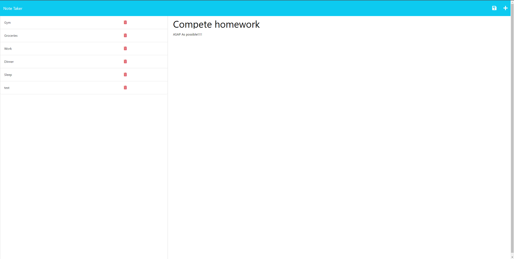

# README Generator

## Description

A note taker to organize thoughts and keep track of tasks that need completion.

## Table of Contents

- [Installation](#installation)
- [Demo](#demo)
- [License](#license)
- [Contact](#contact)

---

## Installation

Run "NPM i" in the root directory of the application, and then type "node server.js" or "node server" to start the program.

---

---

## License

MIT

---

## Contact

Please reach out to joey.tranvik@gmail.com if you have any questions.
